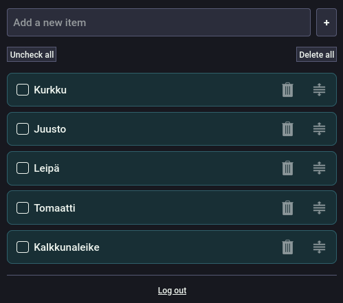
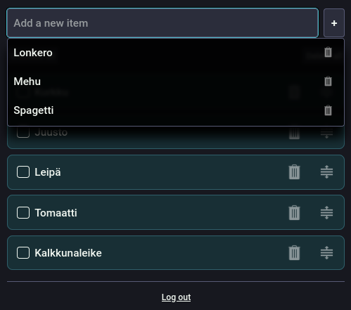
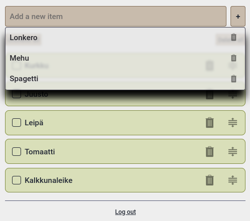

# Shopping List

A simple shopping list application written in [Go](https://go.dev/) that allows multiple users to edit the list at the same time with real-time updates.

## Background
My partner and I used to manage our own shopping lists in different apps. Before one of us went to shopping, we had to check with the other to see if there is was anything to add to the list. And if one of us was already at the store, we had to call or text if we wanted to make sure we got the items missing from the list.

With the application, the shopping list can be updated from anywhere and updates are instantly visible to everyone. There is no need to manage multiple shopping lists.

I created this application for our company's hackathon, where the goal was to create an application that improves productivity, using languages or techniques you have zero or very little experience with. The focus was on learning something new.

I am a backend developer, so here are the things I learned while building the application:
- Websockets using Go and vanilla JavaScript
- Drag and drop interface
- Light and dark mode detection and handling
- Designing for different screen sizes
- PWA applications

I did not want to use any JavaScript libraries, so everything is implemented using vanilla JavaScript. Yes, it was a painful experience. Figuring out drag and drop was so painful that I created a [working example](https://github.com/saaste/sortable-list-example) so that you don't have to feel the same agony.

## Features
- Real-time updates on all devices using websockets
- Drag and drop sorting of items (works with touch too!)
- Automatic favorites management based on the usage
- Simple and easy to use interface
- Data stored to a single file - no database needed!
- Light and dark mode
- Mobile friendly
- PWA support
- Password protection
- Easy to run on Docker

### Favorites explained
Every time you add a new item, it becomes a favorite. The app keeps track of how often each item is used. Favorites are sorted by popularity and show the top 10 most used items. The list is filtered by the text written in the 'Add a new item' input.

Items already in the list are not displayed. If you made a typo or just want to remove a favorite, just click the trash can icon next to it.

Once you add your most frequently used items as favorites, you can manage your shopping list with very little typing.

## Setup
To get started, follow these steps:
1. Clone the respository with `git clone https://github.com/saaste/shopping-list.git`
2. Copy the following example files:
    - docker-compose.yml.example ➔ docker-compose.yml
    - data.json.example ➔ data.json
    - config.json.example ➔ config.json
3. Configure values in `config.json`
4. [Optional] Add custom styles to `ui/static/custom.css`.


## How to run
### How to run with Go
The only requirement is [Go](https://go.dev/). You can start the app with:
```
go run . [--port PORT]
```
By default the app will run on port 8000.

### Running with Docker
The only requirement is [Docker](https://www.docker.com/). You can start the app with:
```
docker-compose up [-d]
```
By default, the app listens on port 8000. You can modify the port in the `docker-compose.yaml` file.

## Preview


